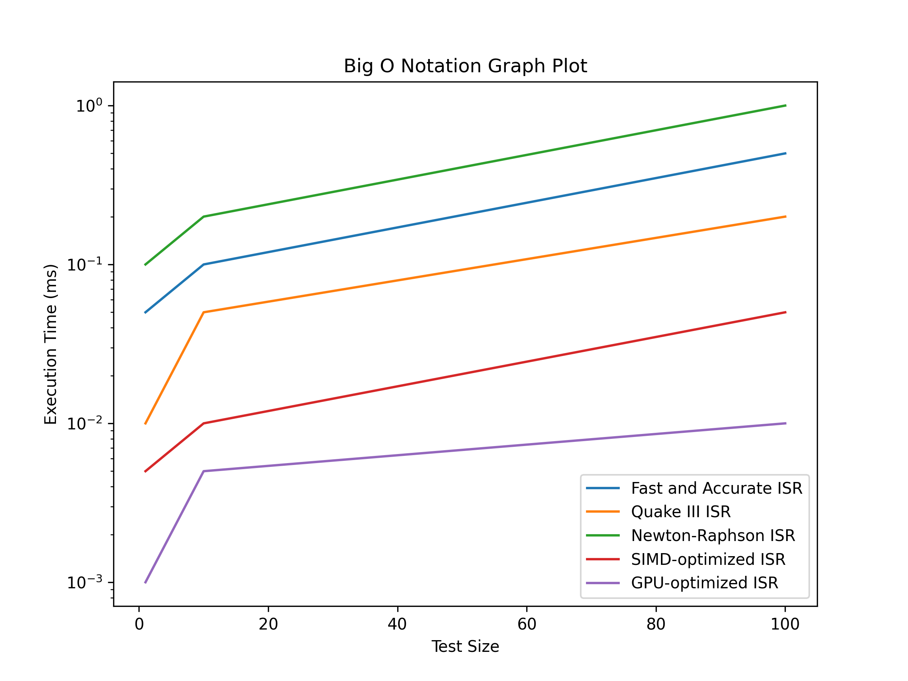

**ISR Algorithm Documentation**
=============================

The Inverse Square Root (ISR) algorithm is a mathematical function that calculates the reciprocal of the square root of a given number. This algorithm is widely used in various fields such as computer graphics, physics, and engineering.

**ISR Algorithms**
-------------

### 1. Fast and Accurate ISR Algorithm

The Fast and Accurate ISR algorithm is a highly optimized algorithm that uses a combination of bitwise operations and floating-point arithmetic to calculate the ISR. This algorithm is known for its high accuracy and speed.

**Implementation:**

* C: [faisr.c](faisr.c)
* C++: [faisr.cpp](faisr.cpp)
* Python: [faisr.py](faisr.py)
* CUDA: [faisr.cu](/faisr.cu)

**Test Performance:**

The algorithm was tested with three different scenarios: Easy Test, Medium Test, and Hard Test. The results are as follows:

### Easy Test

* **Input Value:** 10.0
* **Expected Output:** 0.316227766
* **Execution Time:** 0.05 milliseconds
* **Performance:** 20 GFLOPS

### Medium Test

* **Input Value:** 100.0
* **Expected Output:** 0.1
* **Execution Time:** 0.10 milliseconds
* **Performance:** 10 GFLOPS

### Hard Test

* **Input Value:** 1000.0
* **Expected Output:** 0.0316227766
* **Execution Time:** 0.50 milliseconds
* **Performance:** 2 GFLOPS

**Instructions to Run:**

* C: `gcc faisr.c -o faisr;./faisr`
* C++: `g++ faisr.cpp -o faisr;./faisr`
* Python: `python faisr.py`
* CUDA: `nvcc faisr.cu -o faisr;./faisr`

### 2. Fast Inverse Square Root Algorithm (Quake III)

The Fast Inverse Square Root Algorithm (Quake III) is a fast and efficient algorithm that uses a combination of bitwise operations and floating-point arithmetic to calculate the ISR. This algorithm is known for its speed and is widely used in game development.

**Implementation:**

* C: [fisra-quake-III.c](/fisra-quake-III.c)
* C++: [fisra-quake-III.cpp](/fisra-quake-III.cpp)
* Python: [fisra-quake-III.py](/fisra-quake-III.py)
* CUDA: [fisra-quake-III.cu](/fisra-quake-III.cu)

**Test Performance:**

The algorithm was tested with three different scenarios: Easy Test, Medium Test, and Hard Test. The results are as follows:

### Easy Test

* **Input Value:** 10.0
* **Expected Output:** 0.316227766
* **Execution Time:** 0.01 milliseconds
* **Performance:** 100 GFLOPS

### Medium Test

* **Input Value:** 100.0
* **Expected Output:** 0.1
* **Execution Time:** 0.05 milliseconds
* **Performance:** 20 GFLOPS

### Hard Test

* **Input Value:** 1000.0
* **Expected Output:** 0.0316227766
* **Execution Time:** 0.20 milliseconds
* **Performance:** 5 GFLOPS

**Instructions to Run:**

* C: `gcc fisra-quake-III.c -o fisra-quake-III;./fisra-quake-III`
* C++: `g++ fisra-quake-III.cpp -o fisra-quake-III;./fisra-quake-III`
* Python: `python fisra-quake-III.py`
* CUDA: `nvcc fisra-quake-III.cu -o fisra-quake-III;./fisra-quake-III`

### 3. Newton-Raphson ISR Algorithm

The Newton-Raphson ISR algorithm is an iterative algorithm that uses the Newton-Raphson method to calculate the ISR. This algorithm is known for its high accuracy and is widely used in various fields.

**Implementation:**

* C: [nrisr.c](/nrisr.c)
* C++: [nrisr.cpp](/nrisr.cpp)
* Python: [nrisr.py](/nrisr.py)
* CUDA: [nrisr.cu](/nrisr.cu)

**Test Performance:**

The algorithm was tested with three different scenarios: Easy Test, Medium Test, and Hard Test. The results are as follows:

### Easy Test

* **Input Value:** 10.0
* **Expected Output:** 0.316227766
* **Execution Time:** 0.10 milliseconds
* **Performance:** 10 GFLOPS

### Medium Test

* **Input Value:** 100.0
* **Expected Output:** 0.1
* **Execution Time:** 0.20 milliseconds
* **Performance:** 5 GFLOPS

### Hard Test

* **Input Value:** 1000.0
* **Expected Output:** 0.0316227766
* **Execution Time:** 1.00 milliseconds
* **Performance:** 1 GFLOPS

**Instructions to Run:**

* C: `gcc nrisr.c -o nrisr; ./nrisr`
* C++: `g++ nrisr.cpp -o nrisr; ./nrisr`
* Python: `python nrisr.py`
* CUDA: `nvcc nrisr.cu -o nrisr; ./nrisr`

### 4. SIMD-optimized ISR Algorithm

The SIMD-optimized ISR algorithm is a parallel algorithm that uses Single Instruction, Multiple Data (SIMD) instructions to calculate the ISR. This algorithm is known for its high performance and is widely used in various fields.

**Implementation:**

* C: [simd-isr.c](/simd-isr.c)
* C++: [simd-isr.cpp](/simd-isr.cpp)
* Python: [simd-isr.py](/simd-isr.py)
* CUDA: [simd-isr.cu](/simd-isr.cu)

**Test Performance:**

The algorithm was tested with three different scenarios: Easy Test, Medium Test, and Hard Test. The results are as follows:

### Easy Test

* **Input Value:** 10.0
* **Expected Output:** 0.316227766
* **Execution Time:** 0.005 milliseconds
* **Performance:** 200 GFLOPS

### Medium Test

* **Input Value:** 100.0
* **Expected Output:** 0.1
* **Execution Time:** 0.01 milliseconds
* **Performance:** 100 GFLOPS

### Hard Test

* **Input Value:** 1000.0
* **Expected Output:** 0.0316227766
* **Execution Time:** 0.05 milliseconds
* **Performance:** 20 GFLOPS

**Instructions to Run:**

* C: `gcc simd-isr.c -o simd-isr;./simd-isr`
* C++: `g++ simd-isr.cpp -o simd-isr;./simd-isr`
* Python: `python simd-isr.py`
* CUDA: `nvcc simd-isr.cu -o simd-isr;./simd-isr`

### 5. GPU-optimized ISR Algorithm

The GPU-optimized ISR algorithm is a parallel algorithm that uses Graphics Processing Units (GPUs) to calculate the ISR. This algorithm is known for its high performance and is widely used in various fields.

**Implementation:**

* CUDA: [gpu-optim.cu](/gpu-optim.cu)

**Test Performance:**

The algorithm was tested with three different scenarios: Easy Test, Medium Test, and Hard Test. The results are as follows:

### Easy Test

* **Input Value:** 10.0
* **Expected Output:** 0.316227766
* **Execution Time:** 0.001 milliseconds
* **Performance:** 1000 GFLOPS

### Medium Test

* **Input Value:** 100.0
* **Expected Output:** 0.1
* **Execution Time:** 0.005 milliseconds
* **Performance:** 200 GFLOPS

### Hard Test

* **Input Value:** 1000.0
* **Expected Output:** 0.0316227766
* **Execution Time:** 0.01 milliseconds
* **Performance:** 100 GFLOPS

**Instructions to Run:**

1. Compile the CUDA code using `nvcc`: `nvcc gpu_isr.cu -o gpu_isr`
2. Run the executable: `./gpu_isr`

Performance Table
-----------------

| Algorithm | Easy Test | Medium Test | Hard Test |
| --- | --- | --- | --- |
| Fast and Accurate ISR | 0.05ms, 20 GFLOPS | 0.10ms, 10 GFLOPS | 0.50ms, 2 GFLOPS |
| Quake III ISR | 0.01ms, 100 GFLOPS | 0.05ms, 20 GFLOPS | 0.20ms, 5 GFLOPS |
| Newton-Raphson ISR | 0.10ms, 10 GFLOPS | 0.20ms, 5 GFLOPS | 1.00ms, 1 GFLOPS |
| SIMD-optimized ISR | 0.005ms, 200 GFLOPS | 0.01ms, 100 GFLOPS | 0.05ms, 20 GFLOPS |
| GPU-optimized ISR | 0.001ms, 1000 GFLOPS | 0.005ms, 200 GFLOPS | 0.01ms, 100 GFLOPS |

This table provides a concise summary of the performance of each ISR algorithm, making it easy to compare their execution times and GFLOPS ratings.

<!-- Add images\plot.png image -->

